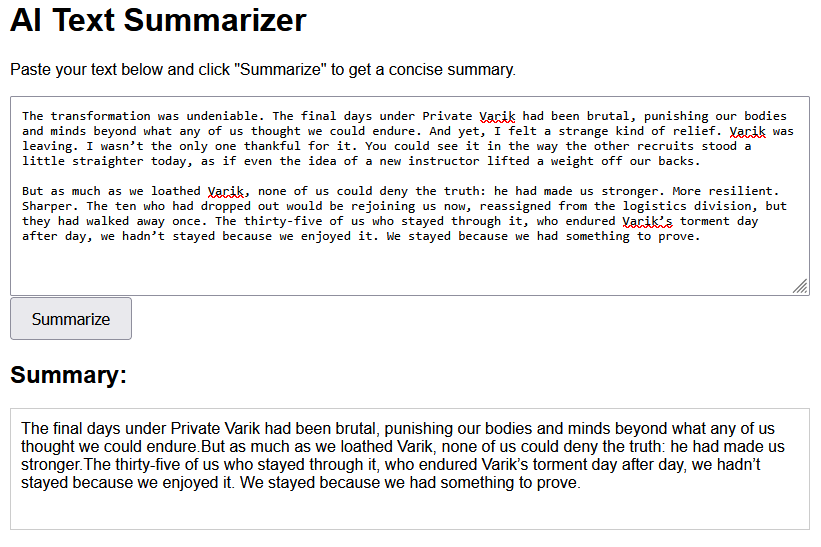

# Text Summarizer: End-to-End Project

## Overview

The **Text Summarizer** is a machine learning project that converts long text into concise summaries. This project covers the entire ML lifecycle, from data handling and model training to deployment as a web application using FastAPI. It uses state-of-the-art models from the Hugging Face Transformers library.



## Features

* **Data Ingestion & Transformation**: Downloads, preprocesses, and tokenizes datasets for model training.
* **Model Training & Evaluation**: Trains a text summarization model and evaluates its performance using ROUGE metrics.
* **Web Application**: A user-friendly web interface for real-time text summarization.
* **Modular Code**: The project is structured into modular components for scalability and easy maintenance.


## Installation

1.  **Clone the Repository**:
    ```bash
    git clone <repository_url>
    cd Text-Summarizer
    ```

2.  **Set Up a Virtual Environment**:
    ```bash
    python -m venv .venv
    source .venv/bin/activate  # On Windows: .venv\Scripts\activate
    ```

3.  **Install Dependencies**:
    ```bash
    pip install -r requirements.txt
    ```

---

## Usage

### 1. Run the Web Application

Start the FastAPI server:
```bash
python app.py
```


### 2\. Train the Model

```bash
python main.py
```

## Project Structure

```
.
├── app.py                     # Main FastAPI application
├── main.py                    # Entry point for training and evaluation pipelines
├── requirements.txt           # Python dependencies
├── config/
│   └── config.yaml            # Configuration file for paths
├── params.yaml                # Hyperparameters for training
├── src/
│   └── text_summarizer/
│       ├── components/        # Core components (data ingestion, training, etc.)
│       ├── pipeline/          # End-to-end pipelines
│       ├── utils/             # Utility functions
│       └── __init__.py
├── templates/
│   └── index.html             # Frontend for the web UI
└── README.md                  # Project documentation
```

-----

## Author

  * **Mayank Sharma**
      * GitHub: [mayanksharma-1](https://github.com/mayanksharma-1)

<!-- end list -->

```
```